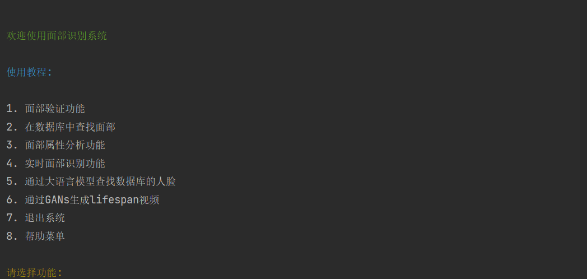

# SUSTech_CV_Project

### 项目简介

本项目为2024年Spring Semester计算机视觉课程的小组期末Project。
本项目主要基于Deepface框架，ChatGPT3.5以及Lifespan age transformation GAN等模型，并将其整合，实现丰富完善的各项功能。初次之外，我们也对Deepface框架，Lifespan age transformation GAN模型等进行了系统性的学习，进行了各项的实验等等，具体内容详见项目报告部分。


### 项目使用

Ⅰ建议本项目在Conda或MiniConda环境中运行。

```
conda env create -f requirements.yaml
```

使用 `requirements.yaml` 与上述命令即可创建相关环境。


Ⅱ 环境构建完成后，请在运行`Main.py`即可开始正常运行。首次运行某些功能时，模型文件可能需要下载，过程较慢，请耐性等等，之后的运行不会重复下载。


Ⅲ 如下图所示，进入本系统后，会有详细的使用教程，依据使用教程即可进行各项操作。

 


### Lifespan age transformation GANs 使用注意

由于[Lifespan Age Transformation Synthesis](https://github.com/royorel/Lifespan_Age_Transformation_Synthesis)项目并没有被集成到PyPi和Anaconda仓库中 ，不能直接使用```conda install```或者```pip install```安装，需要运行的python环境中下载GPU版本的pytorch，并且按照其仓库中的```README.txt```的说明下载依赖，并在本项目中的```Main.py```文件中的```generate_life_span_video()```的```script_directory```替换为```Lifespan Age Transformation Synthesis```项目在你的 local  machine 中的位置